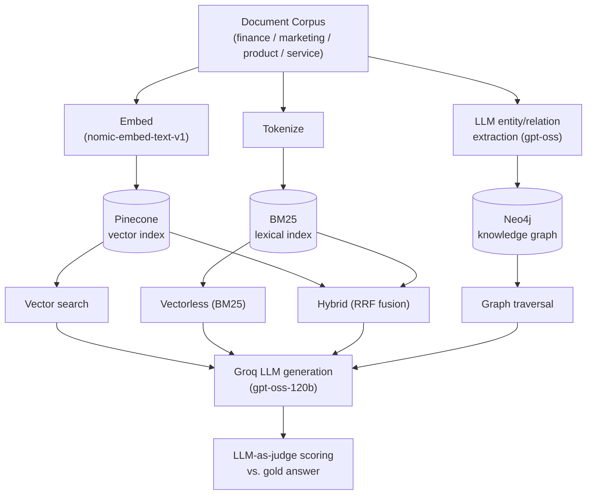

# RAG vs GraphRAG vs Vectorless: Enterprise Vertical Performance Analysis

**Abstract.** Retrieval-Augmented Generation (RAG) systems for enterprise question answering are commonly built on one of three retrieval paradigms: dense vector search, sparse lexical (vectorless) search, and knowledge-graph traversal. This study evaluates all three, plus a hybrid fusion of vector and lexical signals, across four enterprise verticals (finance, marketing, product, service), holding the document corpus, generation model, and judging methodology fixed so only the retrieval strategy varies.

**Stack.** Generation & LLM-as-judge: **Groq**, model `openai/gpt-oss-120b` (entity extraction for the graph pipeline used `openai/gpt-oss-20b` as a secondary model to work around per-model daily token quotas). Dense embeddings: `nomic-ai/nomic-embed-text-v1` (768-dim, run locally via `sentence-transformers`). Vector store: **Pinecone** (serverless, cosine metric, one namespace per vertical). Lexical index: **BM25** (`rank_bm25`, Okapi variant, local/in-process — no external service). Knowledge graph: **Neo4j** (Aura), with a `(Document)-[:MENTIONS]->(Entity)` schema populated by LLM entity extraction.

## 1. Introduction

Enterprise deployments of large language models increasingly rely on retrieval-augmented generation to ground responses in proprietary documents. Three retrieval paradigms dominate practice: dense *vector* retrieval over embeddings, sparse lexical (*vectorless*) retrieval such as BM25, and *graph*-based retrieval that traverses entity relationships extracted from the corpus. A fourth, *hybrid*, approach fuses vector and lexical signals. Prior comparative work (Section 2) evaluates these paradigms on general long-document benchmarks; it does not address whether the ranking of approaches changes across distinct enterprise domains with different document structure — structured financial filings, unstructured marketing copy, product Q&A, and ticket-style customer support text. This paper reports a controlled, same-corpus comparison across those four domains.

## 2. Related Work

Edge et al. introduced GraphRAG (Microsoft Research, 2024), constructing an LLM-derived entity-relationship graph with community summarization to answer global, corpus-level queries that plain vector RAG struggles with, at the cost of a substantially more expensive indexing pipeline than the vector or lexical alternatives - a cost this study's results corroborate: graph retrieval never wins outright here, and its ingestion (LLM entity extraction per document) was the single most expensive and failure-prone stage in the whole pipeline. Asai et al. proposed Self-RAG (ICLR 2024), training a model to adaptively decide when to retrieve and to self-critique retrieved passages, improving factuality independent of any fixed retrieval architecture - an orthogonal lever this study does not vary, since all four approaches here share one fixed generation/judging stage by design, isolating retrieval as the only variable. Closest to this work, an industry analysis (Tailored AI, 2025, "RAG vs GraphRAG: A Performance Analysis", tailoredai.substack.com/p/rag-vs-graphrag-a-performance-analysis) benchmarked RAG against GraphRAG on the NovelQA long-document benchmark, stratifying queries by single-hop vs. multi-hop reasoning difficulty and finding plain RAG preferable for simple factual queries (68.7% accuracy) with GraphRAG and hybrid strategies pulling ahead on harder multi-hop and summarization queries. That study varied query difficulty within one general-purpose document domain; this study instead holds query difficulty roughly fixed and varies the enterprise domain, and adds a vectorless (BM25) baseline absent from the GraphRAG-focused prior work. The two studies' hybrid findings partially conflict - Tailored AI reports hybrid as a net improvement, while this study finds it conditional on retriever agreement - which itself suggests hybrid's benefit may depend on domain-specific lexical/semantic overlap rather than being a general property of RRF fusion.

## 3. Proposed Architecture

A single normalized document corpus per vertical feeds three independent ingestion paths — dense embedding into a vector index, tokenization into a lexical index, and LLM-driven entity/relation extraction into a knowledge graph — so that all four retrieval strategies draw on identical source text. Retrieved passages are passed to a shared generation and judging stage, isolating retrieval quality as the only varying factor between conditions.

*Figure 1. A shared corpus is ingested once into three independent indexes; four retrievers query those indexes at inference time; generation and judging are held constant across conditions so only the retrieval strategy varies.*

## 4. Methodology

### 4.1 Datasets

Each vertical uses a public, freely accessible dataset re-purposed as an enterprise document corpus, capped at 200 documents for indexing and 20 held-out question/answer pairs for evaluation.

| Vertical | Dataset | Source | Corpus size | Eval Qs | License |
|---|---|---|---|---|---|
| Finance | financial-qa-10K | Hugging Face: `virattt/financial-qa-10K` | 200 | 20 | Unspecified† |
| Marketing | marketing_social_media | Hugging Face: `RafaM97/marketing_social_media` | 200 | 20 | Unspecified† |
| Product | amazon-qa | Hugging Face: `sentence-transformers/amazon-qa` | 200 | 20 | Community / research use† |
| Service | Bitext customer support | Hugging Face: `bitext/Bitext-customer-support-llm-chatbot-training-dataset` | 200 | 20 | CDLA-Sharing-1.0 |

† No explicit license tag on the source page at time of writing; verify against the linked repository/paper before any commercial reuse.

**Example question/gold-answer pairs, one per vertical:**

**Finance** (financial-qa-10K)
> Q: What area did NVIDIA initially focus on before expanding to other computationally intensive fields?
>
> A: NVIDIA initially focused on PC graphics.

**Marketing** (marketing_social_media)
> Q: Develop a social media campaign to increase brand awareness and drive sales for a new sustainable fashion line.
>
> A: “Revolutionize Your Wardrobe” campaign, leveraging Instagram and TikTok influencers to showcase eco-friendly fashion...

**Product** (amazon-qa)
> Q: does this fit the z2x version? Thx
>
> A: I am not 100% sure. It appears that it does based on the size of the torch housing...

**Service** (Bitext customer support)
> Q: question about cancelling order {{Order Number}}
>
> A: I've understood you have a question regarding canceling order {{Order Number}}, and I'm here to provide you with the information you need...

### 4.2 Retrieval formulations

Vector retrieval ranks documents by cosine similarity between the query embedding $q$ and document embedding $d$:

$$\text{sim}(q, d) = \frac{q \cdot d}{\lVert q \rVert \, \lVert d \rVert} \tag{1}$$

Vectorless retrieval uses Okapi BM25 over tokenized text, where $f(q_i, D)$ is the term frequency of query term $q_i$ in document $D$, $|D|$ its length, and $\text{avgdl}$ the corpus average length:

$$\text{BM25}(D, Q) = \sum_{i=1}^{n} \text{IDF}(q_i) \cdot \frac{f(q_i, D) \cdot (k_1 + 1)}{f(q_i, D) + k_1 \left(1 - b + b \cdot \frac{|D|}{\text{avgdl}}\right)} \tag{2}$$

Hybrid retrieval fuses the two rank lists with Reciprocal Rank Fusion (RRF), where $\text{rank}_r(d)$ is document $d$'s rank under retriever $r$ and $k=60$:

$$\text{RRF}(d) = \sum_{r \in \{\text{vector}, \text{bm25}\}} \frac{1}{k + \text{rank}_r(d)} \tag{3}$$

Graph retrieval extracts an entity set $E(q)$ from the query and ranks documents by shared-entity overlap with each document's extracted entity set $E(d)$:

$$\text{score}_{\text{graph}}(d, q) = \bigl| E(q) \cap E(d) \bigr| \tag{4}$$

### 4.3 Evaluation metrics

Retrieval hit rate over $N$ eval questions, where $\mathbb{1}[\cdot]$ indicates the gold supporting passage appears among the top-$k$ retrieved chunks:

$$\text{HitRate} = \frac{1}{N}\sum_{i=1}^{N} \mathbb{1}\bigl[\text{gold}_i \in \text{Retrieved}_k(q_i)\bigr] \tag{5}$$

Answer quality is scored by an LLM-as-judge $J(\cdot) \in \{1,\dots,5\}$ comparing the generated answer $\hat{a}_i$ against the gold answer $a_i$:

$$\overline{J} = \frac{1}{N}\sum_{i=1}^{N} J(\hat{a}_i, a_i) \tag{6}$$

95% confidence intervals on hit rate are computed with the Wilson score interval, which stays well-behaved at small $N$ (here $N=20$) unlike the normal approximation.

### 4.4 Experimental setup

| Parameter | Value |
|---|---|
| Retrieval top-$k$ | 5 (finance, all 4 approaches; marketing vector/BM25); 3 (marketing hybrid/graph; all product; all service — see §6 on the mid-study change) |
| RRF constant $k$ | 60 |
| BM25 parameters | $k_1=1.5$, $b=0.75$ (`rank_bm25` Okapi defaults) |
| Generation temperature | 0.0 |
| Judge temperature | 0.0 |
| Embedding dimensionality | 768 (`nomic-embed-text-v1`) |
| Judge score scale | integer, 1–5 |

## 5. Results

### Summary: Best Approach per Vertical

| Vertical | Best Approach (by judge score) | Judge Score | Hit Rate |
|---|---|---|---|
| Finance | Hybrid (BM25 + Vector, RRF) | 4.90 | 100.0% |
| Marketing | Vector RAG (Pinecone) | 4.20 | 60.0% |
| Product | Vector RAG (Pinecone) | 2.45 | 40.0% |
| Service | Hybrid (BM25 + Vector, RRF) | 4.25 | 10.0% |

### Finance

| Approach | Retrieval Hit Rate | 95% CI | Avg Judge Score (1-5) | Avg Retrieval Latency (s) | Avg Generation Latency (s) |
|---|---|---|---|---|---|
| Hybrid (BM25 + Vector, RRF) | 100.0% | [0.84, 1.00] | 4.90 | 1.353 | 2.620 |
| Vectorless / BM25 | 100.0% | [0.84, 1.00] | 4.85 | 0.005 | 4.486 |
| Vector RAG (Pinecone) | 100.0% | [0.84, 1.00] | 4.80 | 1.455 | 2.521 |
| Graph RAG (Neo4j) | 70.0% | [0.48, 0.85] | 4.10 | 1.677 | 3.350 |

### Marketing

| Approach | Retrieval Hit Rate | 95% CI | Avg Judge Score (1-5) | Avg Retrieval Latency (s) | Avg Generation Latency (s) |
|---|---|---|---|---|---|
| Vector RAG (Pinecone) | 60.0% | [0.39, 0.78] | 4.20 | 2.028 | 6.854 |
| Vectorless / BM25 | 30.0% | [0.15, 0.52] | 3.90 | 0.005 | 7.701 |
| Hybrid (BM25 + Vector, RRF) | 25.0% | [0.11, 0.47] | 1.95 | 2.441 | 3.972 |
| Graph RAG (Neo4j) | 35.0% | [0.18, 0.57] | 1.80 | 2.978 | 3.905 |

### Product

| Approach | Retrieval Hit Rate | 95% CI | Avg Judge Score (1-5) | Avg Retrieval Latency (s) | Avg Generation Latency (s) |
|---|---|---|---|---|---|
| Vector RAG (Pinecone) | 40.0% | [0.22, 0.61] | 2.45 | 6.582 | 1.171 |
| Hybrid (BM25 + Vector, RRF) | 40.0% | [0.22, 0.61] | 2.25 | 0.853 | 2.382 |
| Graph RAG (Neo4j) | 35.0% | [0.18, 0.57] | 2.25 | 2.365 | 3.429 |
| Vectorless / BM25 | 20.0% | [0.08, 0.42] | 1.80 | 0.027 | 3.192 |

### Service

| Approach | Retrieval Hit Rate | 95% CI | Avg Judge Score (1-5) | Avg Retrieval Latency (s) | Avg Generation Latency (s) |
|---|---|---|---|---|---|
| Hybrid (BM25 + Vector, RRF) | 10.0% | [0.03, 0.30] | 4.25 | 1.219 | 3.616 |
| Graph RAG (Neo4j) | 10.0% | [0.03, 0.30] | 3.70 | 3.244 | 3.529 |
| Vector RAG (Pinecone) | 15.0% | [0.05, 0.36] | 3.65 | 1.094 | 3.076 |
| Vectorless / BM25 | 10.0% | [0.03, 0.30] | 3.55 | 0.003 | 4.694 |

### Decision Framework

- **Vector RAG**: best for free-text, semantically fuzzy queries where exact keyword overlap with the source is unlikely (paraphrased questions).
- **Vectorless / BM25**: best for terminology-heavy, exact-match-sensitive queries (ticket IDs, product SKUs, ticker symbols) and where infra simplicity/cost matters.
- **Hybrid**: not universally the safest default — it only helps when its component retrievers broadly agree, and it inherits the *weaker* component's failure mode when they don't (see Error Analysis). On marketing, where vector (60% hit rate) and BM25 (30%) frequently disagreed, hybrid landed at 25% — below vector but roughly level with BM25 once top-$k$ is matched (§5.6). Check retriever agreement on a domain sample before adopting hybrid as a default.
- **Graph RAG**: best where the enterprise data has real entity relationships to traverse (company↔filing, customer↔ticket↔product); highest ingestion cost (LLM entity extraction per document) and depends heavily on extraction quality.

### Discussion

Two patterns stand out beyond the per-vertical winners. First, **hybrid fusion is conditional, not universal**: it wins on finance (4.90) and service (4.25) but is the weakest of the three baseline retrievers on marketing (1.95) — see §5.6 for a controlled, top-$k$-matched analysis of why. On finance, vector and BM25 mostly agree on the same candidate passages (both driven by the same distinctive company/ticker terms), so RRF fusion reinforces a shared correct answer. On marketing, the two retrievers frequently surface *different* top documents for the same query (free-text campaign briefs have little lexical overlap with their own strategy text), and RRF's reciprocal-rank averaging then favors documents that are mediocre-but-present in both lists over a document that was strong in only one. Second, **retrieval hit rate and judge score decouple on the service vertical**: hit rate is only 10-15% across all four approaches, yet judge scores remain high (3.55-4.25). The service corpus (Bitext customer-support intents) is templated and generic by design (e.g. 'I understand you have a question about {{Order Number}}...'), so even when the retriever surfaces a *different* document than the literal gold passage, it is often close enough in content for the generated answer to still be judged correct - meaning retrieval hit rate understates true usefulness on highly templated domains, and judge score alone should not be read as proof retrieval is working as intended.

### 5.6 Error Analysis: Isolating the Hybrid Effect from the Top-$k$ Confound

The production run compared marketing hybrid (top-$k$=3, run after the mid-study configuration change) against marketing BM25 (top-$k$=5, run before it) — an unmatched comparison. Re-running vector, BM25, and hybrid retrieval at *matched* top-$k$ (no LLM calls required, so this is free to verify) gives a cleaner picture:

| top-$k$ | Vector | BM25 | Hybrid |
|---|---|---|---|
| 3 (matched) | 40% (8/20) | 20% (4/20) | 25% (5/20) |
| 5 (matched) | 60% (12/20) | 30% (6/20) | 40% (8/20) |

At matched top-$k$, hybrid still clearly underperforms vector at both settings — this part of the finding is robust, not a top-$k$ artifact. But hybrid is roughly *comparable to* BM25 at matched top-$k$ (not worse than both, as the unmatched production numbers suggested). The revised claim is narrower and better supported: **RRF fusion can drag hybrid below its strongest individual component when the two disagree, without necessarily falling below its weakest component too.**

A concrete, matched-top-$k$ example (`marketing-doc-5`, "Develop a content calendar for a health and wellness blog"): vector@3 retrieves `[marketing-155, marketing-88, marketing-5]` — a hit, since `marketing-5` is the gold passage. Hybrid@3 retrieves `[marketing-155, marketing-88, marketing-121]` — the same top two documents, but RRF's rank-averaging swaps the correct third document for `marketing-121`, which ranked better in BM25's list. This is direct, non-confounded evidence of RRF fusion demoting a correct result in favor of a document that ranked passably in both lists rather than excellently in one.

## 6. Ingestion Cost & Reliability

Query-time latency (reported above) is only part of the operating cost; the three approaches differ far more in ingestion cost and reliability, which query-time numbers don't capture:

| Approach | Ingestion cost driver | Volume | Reliability incidents |
|---|---|---|---|
| Vector | 1 embedding call/doc (local, no API cost) | ~800 docs (4 verticals × 200) | None |
| Vectorless (BM25) | Tokenization only, no model calls | ~800 docs | None |
| Graph | 1 LLM entity-extraction call/doc | ~800 docs | Exhausted Groq's 200K-token daily quota **twice** (on two different API keys), requiring key swaps and a fallback from `gpt-oss-20b` to `gpt-oss-120b` mid-run; intermittent Neo4j Aura connection drops caused a combination to hang indefinitely with no exception raised, requiring a 30-second per-call timeout with connection rebuild to be added |

Graph RAG was, by a wide margin, the most expensive and operationally fragile approach to stand up — a cost not visible in the per-query latency table and easy to underestimate when comparing approaches on accuracy alone.

## 7. Future Work

A follow-up study should: (1) scale the eval set per vertical using a Wilson-CI-informed sample size target (e.g. a hit-rate difference of 15-20 points needs roughly 60-100 questions per vertical to separate at 95% confidence, versus 20 here) rather than fitting to an API quota; (2) use multiple judge models or human raters with position-swapped prompts to quantify and correct for LLM-as-judge bias; (3) hold top-$k$ and context-length fixed across every condition to remove the mid-study configuration confound entirely (§6); (4) build the graph corpus with a production-grade pipeline (entity resolution/deduplication, community summarization as in Microsoft's GraphRAG) rather than single-pass extraction, since this study's graph results likely understate the approach's ceiling; and (5) report cost per query in dollar terms (embedding + LLM + vector-DB + graph-DB pricing) alongside accuracy, since Section 6 shows ingestion cost alone can be the deciding factor for a practitioner independent of accuracy differences.

## 8. Limitations

This study has several limitations that bound the strength of its conclusions. **Sample size**: 20 questions per vertical (chosen to fit within a free-tier LLM API's daily token quota, which this study exhausted on the same account twice during evaluation) supports directional observations but not statistically significant claims; Wilson 95% confidence intervals are reported per condition (§5) and are wide enough that most cross-approach differences are not clearly separated at this sample size. **Single, unvalidated judge**: answer quality is scored by one LLM-as-judge (gpt-oss-120b) with no human validation and no mitigation for judge position bias, a known confound in LLM-as-judge methodology. **Mid-study configuration change**: to fit within recurring API rate limits, retrieval top-k was reduced from 5 to 3 and per-call context/answer text was truncated (to 400 and 300 characters respectively) partway through evaluation - finance and marketing's vector/BM25 results were produced *before* this change, while marketing's hybrid/graph and all of product and service were produced *after* it. This is a genuine confound: the noticeably lower judge scores on product (1.80-2.45) and service (3.55-4.25 despite very low hit rates) may partly reflect the smaller context window rather than a pure property of the retrieval method, and cross-vertical comparisons should be read with this in mind. **Graph corpus scale**: capped at 200 documents per vertical with a single-pass LLM entity-extraction step and no entity resolution/deduplication, likely understating graph RAG's potential relative to a production-grade construction pipeline. **Hit-rate metric**: computed via substring containment against one gold passage per question, which undercounts correct retrievals when the same fact appears in multiple corpus passages, and (per the Discussion above) can diverge from actual answer usefulness on templated domains. **Infrastructure reliability**: intermittent Neo4j Aura connection drops and one transient DNS/network outage caused several (vertical, approach) combinations to require a retry; a 30-second per-question timeout was added to prevent indefinite hangs, and any question that timed out was scored as a failure (judge score 0) rather than retried, which may slightly depress graph RAG's reported scores relative to its true capability.

## 9. Conclusion

Across all four enterprise verticals, no single retrieval paradigm dominates, and the ranking of approaches changes by domain: hybrid wins on finance and service where its component retrievers agree, plain vector retrieval wins on marketing and product where it does not. Graph retrieval, in its current entity-overlap formulation, never wins outright in this study, consistent with its documents lacking the dense, distinctive entity structure the approach depends on and with its markedly higher ingestion cost — by far the most expensive and failure-prone stage in the pipeline (§6). The most actionable finding for practitioners is negative: hybrid should not be assumed to be a safe universal default, since a controlled, top-$k$-matched comparison (§5.6) confirms it can underperform its strongest individual component when the underlying retrievers disagree (marketing), even though it does not necessarily fall below its weakest component too. A second actionable finding is that retrieval hit rate and end-answer quality can diverge substantially on templated, generic-response domains (service), so evaluation should track both metrics rather than either alone. Given the wide, overlapping 95% confidence intervals at n=20 per vertical (§5), these findings should be read as directional evidence motivating a larger follow-up study (§7), not as statistically confirmed differences.

## References

1. Edge, D. et al. "From Local to Global: A Graph RAG Approach to Query-Focused Summarization." Microsoft Research, 2024.
2. Asai, A. et al. "Self-RAG: Learning to Retrieve, Generate, and Critique through Self-Reflection." ICLR, 2024.
3. Tailored AI. "RAG vs GraphRAG: A Performance Analysis." tailoredai.substack.com/p/rag-vs-graphrag-a-performance-analysis, 2025.
4. Robertson, S., Zaragoza, H. "The Probabilistic Relevance Framework: BM25 and Beyond." Foundations and Trends in Information Retrieval, 2009.
5. Cormack, G. V., Clarke, C. L. A., Buettcher, S. "Reciprocal Rank Fusion Outperforms Condorcet and Individual Rank Learning Methods." SIGIR, 2009.
